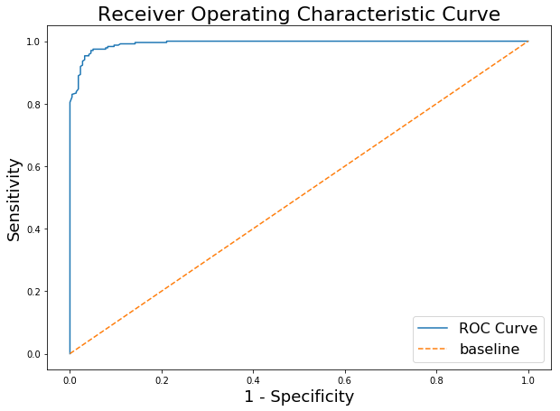
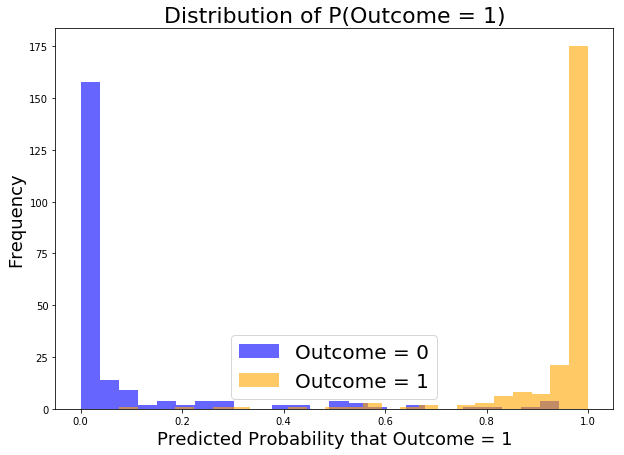
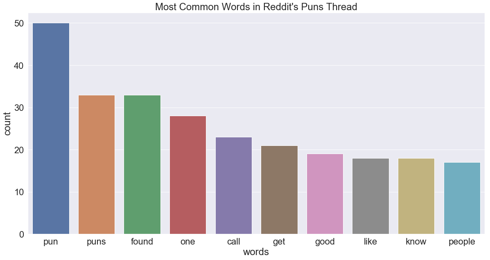
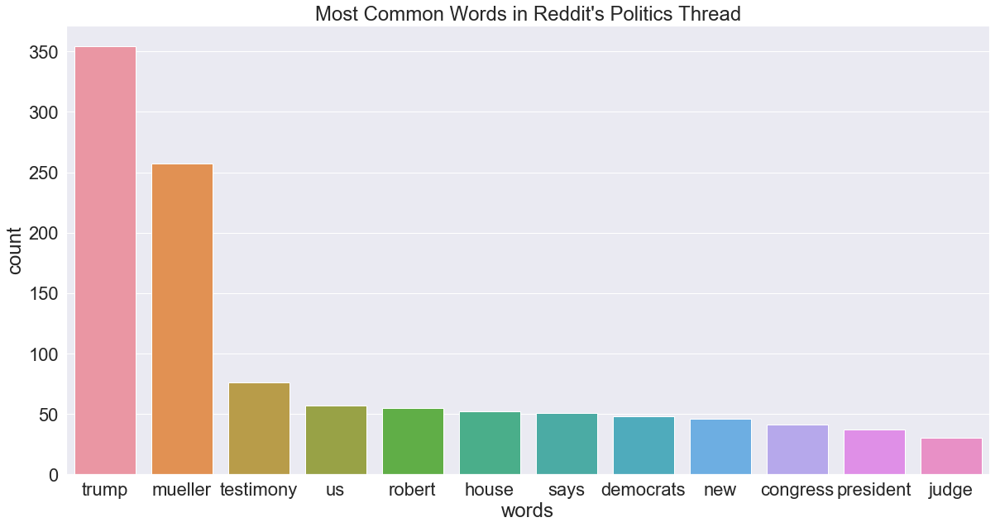
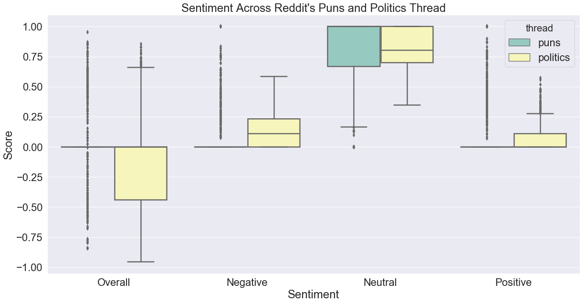

#  Project 3: Web APIs & Classification

### Problem Statement

Given two subreddit threads, how can we determine from which thread does a given post comes from?

------

### Goal

To use API to extract data from reddit and to develop a classification model that could:

1. differentiate posts in puns (url: https://www.reddit.com/r/puns/) from politics (url: https://www.reddit.com/r/politics) based on `post title` using **Natural Language Processing**,

2. analyze the most frequently occuring words in `post title`, and

3. analyze the sentiment of the posts.

------

### The Data Science Process

**Data Collection** 

-  `post title` was collected from the **puns** and **politics** subreddit threads through the use of Python Request library and Reddit's API
- A total of 938 unique  `post title` were collected from the **puns** thread while 870 unique  `post title` were collected from the **politics** thread 
- A rest time of 1 second was inserted between each API call for 25 posts to avoid overloading Reddit's server
- The collected data were exported to a csv, with  `post title` from **puns** assigned a `target value` of **1** while `post title` from **politics** were assigned a `target value` of **0**.

**Data Cleaning and EDA** 

- To prepare the data in the Pandas DataFrame for post origin prediction, special characters were removed from each post title and all the characters are set to lowercase.
- To prepare the data to analyze the most frequent words, the list of post titles were first tokenised before flattening the list in a single layer list. Then, stop words (English), special characters, blanks, 's' and 'nt' were removed. All words inside the list are also set to lowercase.

**Preprocessing and Modeling** 

*Thread Prediction*:

- The data was divided into 75:25 for Train:Test split.
- To determine the best vectorizer and the best classification model, a double loop was written to pass through *CountVectorizer*, *TF-IDF Vectorizer* and *Hash Vectorizer* to vectorize the `post title` before applying the *Bernoulli* and *Multimodial* Naive Bayes' classification models and the *Logistic Regression*, *K-Nearest Neighbour* and *Support Vector Machine* classification model.
- Stopwords in English were removed
- Pipeline was used expedite the experiment and GridSearch was used to determine the best hyper parameters to be used for the classification model.

*Sentiment Analysis*:

- SentimentIntensityAnalyzer** from the vader library was used to parse the sentiment of each post title. 

**Evaluation**

*Thread Prediction*:

- Based on the experiments, the alternative classifier(Support Vector Machines) using Hash Vectorizer was able to accurately differentiate a post on the puns thread and a post from the politics thread with a R2 score of 0.94469. 

| Rank | Model                  | Vectorizer | R2 Score |
| ---- | ---------------------- | ---------- | -------- |
| 1    | Alternative Classifier | Hash       | 0.951435 |
| 2    | Alternative Classifier | TD-IDF     | 0.938190 |
| 3    | Alternative Classifier | Count      | 0.931567 |
| 4    | Bernoulli              | Count      | 0.929360 |
| 5    | Bernoulli              | TD-IDF     | 0.929360 |
| 6    | Multimodial            | Count      | 0.927152 |
| 7    | Multimodial            | TD-IDF     | 0.927152 |
| 8    | Multimodial            | Hash       | 0.905077 |
| 9    | Bernoulli              | Hash       | 0.518764 |

* Confusion Matrix (based on Support Vector Machines with Hash Vectorizer):

  | Confusion Matrix | Predicted Negative | Predicted Positive |
  | ---------------- | ------------------ | ------------------ |
  | Actual Negative  | 200                | 18                 |
  | Actual Positive  | 4                  | 231                |

- The performance of the model is summarised below:

  | Measurement          | Score  |
  | -------------------- | ------ |
  | Specificity          | 0.9174 |
  | Recall / Sensitivity | 0.983  |
  | Type I Error         | 18     |
  | Type II Error        | 4      |

- The Receiver Operating Characteristic Curve is shown below, with an area under the curve of almost 1, which represents a very accurate prediction by the model.

  

- The distribution of the predictions probability are shown below:

  

  

* The incorrectly predicted titles are:

  | Index | Title                                             | True     | Predicted |
  | ----- | ------------------------------------------------- | -------- | --------- |
  | 1     | he didnt appreciate it as much as i did           | Puns     | Politics  |
  | 2     | us currency has some of the highest math scores possible | Puns     | Politics  |
  | 3     | why was the ratio of the side opposite an angle to the hypotenuse sick | Puns     | Politics  |
  | 4     | that new caffeinated water should be renamed as h2joe | Puns     | Politics  |
  | 5     | in god we trust going up at south dakota public schools | Politics | Puns      |
  | 6     | rand paul aide calls jon stewart a disheveled charlatan | Politics | Puns      |
  | 7     | those hit hardest by student debt never finish college | Politics | Puns      |
  | 8     | barr says police need encryption backdoors doesnt mention hacking tools they use all the time | Politics | Puns      |
  | 9     | house passes measure endorsing all trumpfocused subpoenas | Politics | Puns      |
  | 10    | thank laws supported by atampt and comcast for californias broadband monopoly problem | Politics | Puns      |
  | 11    | ethics office investigates whether interior dept officials violated transparency laws | Politics | Puns      |
  | 12    | orourke what we saw in north carolina last week was almost an impromptu nuremberg rally | Politics | Puns      |
  | 13    | joe what a great day it was for gop and putin     | Politics | Puns      |
  | 14    | newt gingrich just gave away the game             | Politics | Puns      |
  | 15    | when will we get the full truth about how and why the government is using face recognition | Politics | Puns      |
  | 16    | chuck schumer is not a wartime consigliere        | Politics | Puns      |
  | 17    | speaker pelosi press conference with judiciary and intelligence committee chairs | Politics | Puns      |
  | 18    | the cop who said aoc needs a round just got fired chief arthur lawson reportedly fired the 14year veteran of the force and another officer who liked the threatening post | Politics | Puns      |
  | 19    | investigative reporter seymour hersh the world is run by ignoramuses wackos and psychotics | Politics | Puns      |
  | 20    | putins mitch billboard grabs attention on interstate 65	 | Politics | Puns      |
  | 21    | comey if this were a case about somebody other than the president theyd already have been indicted | Politics | Puns      |
  | 22    | what do the democrats stand for inside a fight over americas future | Politics | Puns      |

*Word Frequency*:

- Shown below are the most commonly occuring words in both the reddit threads. It is observed that both threads have very different keywords.

  

  

*Sentiment Analysis*:

- It is observed that most post titles in the **puns** threads are classified as neutral (neither positive nor negative)

  

------

### Summary

- We were able to accurately create a model to determine if a given Reddit `post title` comes from either the **puns** or **politics** thread. Most likely this is due to the very different list of keywords and vocabulary used.

------

### Future Challenge

- To extend the model to include more than two subreddit threads (e.g. 5) to see if the model is able to accurately classify the `post title`.

- To experiment the model using threads that are more similar in content.

  

------

### 
